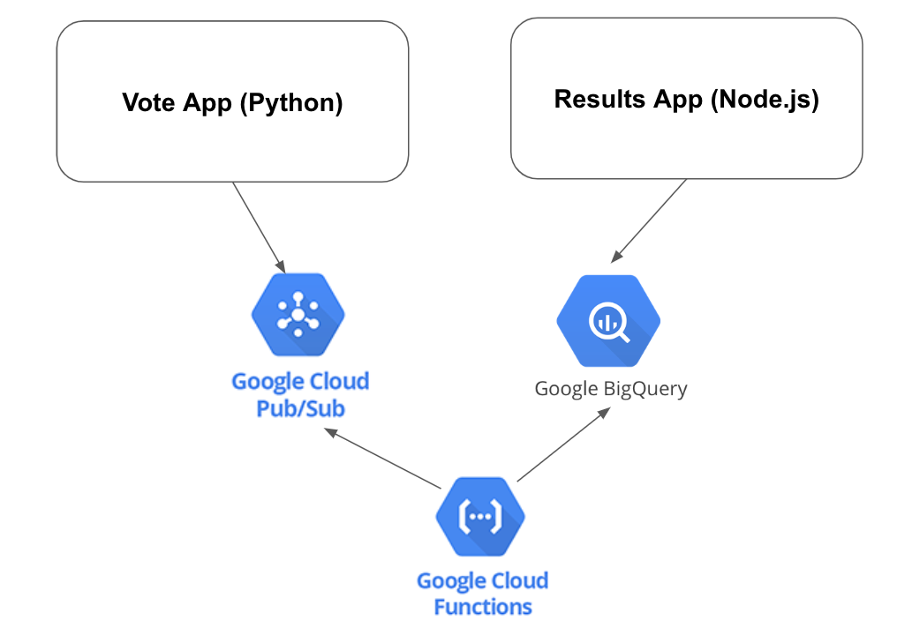

Example Voting App with Pub/Sub and BigQuery 
=========

A simple distributed application running across multiple Docker containers.

Getting started
---------------

## Run in GKE (Google Kubernetes Engine)

> 💡 Recommended if you're using Google Cloud Platform and want to try it on
> resilient platform.

1.  Install tools specified in the previous section (Docker, kubectl, skaffold)

1.  Create a Google Kubernetes Engine cluster and make sure `kubectl` is pointing
    to the cluster.

    ```sh
    gcloud services enable container.googleapis.com
    ```

    ```sh
    gcloud container clusters create demo --enable-autoupgrade \
        --enable-autoscaling --min-nodes=3 --max-nodes=10 --num-nodes=5 --zone=us-central1-a
    ```

    ```
    kubectl get nodes
    ```

1.  Enable Google Container Registry (GCR) on your GCP project and configure the
    `docker` CLI to authenticate to GCR:

    ```sh
    gcloud services enable containerregistry.googleapis.com
    ```

    ```sh
    gcloud auth configure-docker -q
    ```

1. Create *Vote* namespace in Kubernetes

    ```sh
    kubectl create namespace vote
    ```

1.  In the root of this repository, run `skaffold run --default-repo=gcr.io/[PROJECT_ID]`,
    where [PROJECT_ID] is your GCP project ID.

    This command:

    - builds the container images
    - pushes them to GCR
    - applies the `./k8s-specifications` deploying the application to
      Kubernetes.

    **Optional: Build docker images in Goole Container Builder** If you don't have docker running locally and want to still build the images, you can use the *-p gcb* option to build it on Google Cloud

    ```sh
    skaffold run --default-repo=gcr.io/gcr.io/[PROJECT_ID] -p gcb
    ```
    **Troubleshooting:** If you get "No space left on device" error on Google
    Cloud Shell, you can build the images on Google Cloud Build: [Enable the
    Cloud Build
    API](https://console.cloud.google.com/flows/enableapi?apiid=cloudbuild.googleapis.com),
    then run `skaffold run -p gcb --default-repo=gcr.io/[PROJECT_ID]` instead.

    If you have errors with the application, you can use the `-tail` option in skaffold to tail all the logs

1.  Find the IP address of your application, then visit the application on your
    browser to confirm installation.

        kubectl get services -n vote

    **Troubleshooting:** A Kubernetes bug (will be fixed in 1.12) combined with
    a Skaffold [bug](https://github.com/GoogleContainerTools/skaffold/issues/887)
    causes load balancer to not to work even after getting an IP address. If you
    are seeing this, run `kubectl get service frontend-external -o=yaml | kubectl apply -f-`
    to trigger load balancer reconfiguration.

Architecture
-----



* A front-end web app in [Python](/vote) or [ASP.NET Core](/vote/dotnet) which lets you vote between two options
* A PubSub topic that accepts new votes
* A Function that is triggered by PubSub 
* A BigQuery table that collects all the votes
* A [Node.js](/result) webapp which shows the results of the voting in real time


Note
----

This version of voting allows multiple votes per client. The tally will only account for the latest vote
